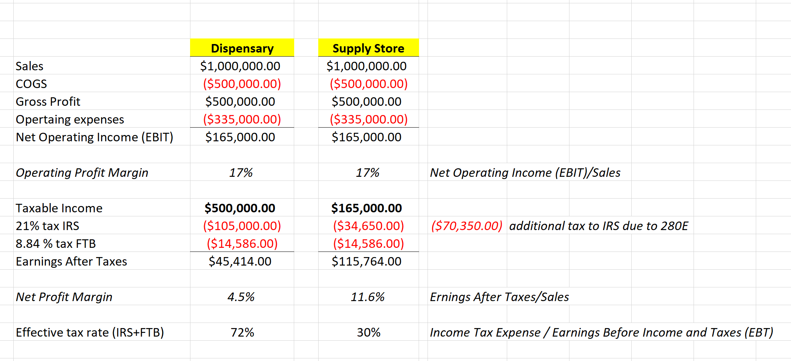
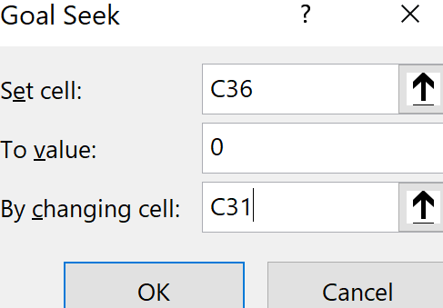

In this blog, I will give you a brief outlook on the dispensary profit margin and how much you are expected to take home.

There are a couple of ways to measure profitability. Operating Profit Margin and Net Profit are the most common formulas.

Operating Profit margin has the following formula:

***Operating Profit Margin = Operating Income (EBIT) / Sales Revenue.***

As you can see in the picture, both cannabis and supply stores have the same operating profit margin of 17 percent, given the same sales and expenses. Seventeen percent is considered a good operating profit margin. But does that mean that the cannabis dispensary is just as profitable as the supply store? Unfortunately, it does not. Due to the 280E rule, dispensaries are not allowed to deduct operating expenses. The only permitted deduction is COGS (cost of goods sold). Because of these disallowed deductions, the dispensary's taxable income is much higher (500k vs. 165k), and so is the amount of tax owed itself. This means less profit for you.

Net profit margin is more useful when it comes to the evaluation of cannabis businesses because it takes into account taxes. Here is its formula:

***Net Profit Margin = Earnings After Taxes / Sales Revenue.***

 As we can see, the net profit margin of our cannabis dispensary is only 4.5%. Given identical revenue and expenses, a supply store's net profit margin is 11.6%. Taxes eat up a significant portion of the dispensaries' profit, making dispensaries barely profitable.

  Let’s take a closer look at the tax issue and assume that our dispensary is a C-Corp located in California. Luckily for us, California does not conform with 280E and allows cannabis businesses to deduct all operating expenses, not just the COGS. Current C-Corp tax rates are 21% for Federal and 8.84% for State. If we run those numbers, we will see that an effective tax rate for an average cannabis dispensary in California is around 72%, as opposed to our legal supply store, which has a tax rate of approximately 30%.

  So, if you think you will be an instant millionaire by opening a dispensary, you are wrong. However, there are ways around it. One way is to increase your sales and keep non-deductible operating expenses low. Consider opening up new locations or increasing client traffic to the established location. There are a couple of strategies that would allow you to deduct some of the operating expenses too, but you will need CPA guidance to execute those strategies.

  Even though cannabis dispensaries are not the most profitable business currently, the legalization of marijuana is coming. By creating your business now, you will have better chances of establishing yourself in the market and position yourself for a good future cash flow. I am attaching a calculator that you can use to get an estimated idea of cash that a dispensary will bring after you pay off taxes and operating expenses. 

***Now*** ***let's*** ***talk about Break-Even Analysis***

 Break-Even is a formula used to calculate the number of sales your business needs to become profitable. The break-even point happens when your sales equal your costs, and your earned income is zero. Reaching this point sooner than later makes it better for the business since you know you are continuing to make a profit. This number also tells you when you are finally done paying off your business and are in the profit zone. 

  There are a couple of ways to calculate the break-even point. I designed my break-even formula specifically for cannabis dispensaries. It includes an allowance for tax expenses and a deductible portion of operating expenses **[(read about what could be deducted here](https://redeyecpa.com/blog/what-can-i-deduct-as-a-cannabis-reseller/)).** To use this formula, you will need to open the Operating Net Profit and Break-Even Analysis calculators **[here](https://1drv.ms/x/s!AselSA_JkDMsjBfRjuxwB97GbUwF?e=KXf0oU)** 

In the excel document, enter your average monthly operating expenses and run the Goal Seek function in excel. To run Goal Seek, go to Data-->What is Analysis-->Goal Seek. Then set up a cell to the values shown in the picture

The sales number will tell you how much you will need to sell that month to break even. Please note, I assumed that the mark up on your sales is double what you paid for the product. I also assumed that you could deduct 8% of your operating expenses. 

If you need assistance with using the calculators, please contact me and I will e-mail them without a charge,

Sincerely,

Daria Nagal, **[Cannabis CPA](https://redeyecpa.com/blog/how-to-choose-cannabis-accountant/)**

