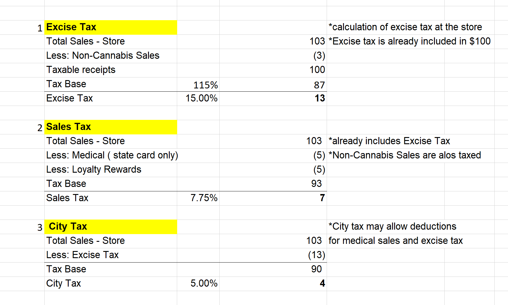

When I worked at a large dispensary chain in San Diego, my primary responsibility was to account for Sales, Excise, and City taxes. These taxes are so messy that even our cannabis lawyers could not agree on the proper way to calculate them. I honestly tried a couple of online cannabis tax calculators, but none of them was correct. This is mostly because of contradicting guidance coming from the CDTFA. They themselves are pretty confused.

Well, here is a brief summary of what I consider to be a correct way to calculate these taxes.

**Excise tax**. The easiest one. 15% of your gross sales.  We levy this tax on gross receipts from ALL Cannabis products, including medical marijuana. As a dispensary, you are required to remit Excise tax to your distributor and later reimburse yourself via charging this tax at your retail location. What happens if you are both a distributor and dispensary? **[Here](https://redeyecpa.com/blog/how-to-calculate-california-cannabis-excise-tax/)** you can find a little information on the issue.

By default, the Excise tax is included in your sales price at the store location. So, if your selling price is $87, your total cost to the customer including excise tax will be $100. ($87*1.15=$100). 

One more note on Excise tax. When you calculate gross receipts, do not forget to exclude all non-cannabis merchandise. Depending on your Point of Sales system, you can pull a correct sales report, or would have to manually adjust your sales for this deduction.

**Sales tax.** This is the most difficult Cannabis tax. The tax rate starting 7.5% of your gross sales. I will eventually write a separate blog on just how to calculate SUT. The key problem with this tax is that you would have to back out Medical sales and may (depending on the interpretation of what you read on the CDTFA website) include City tax. Excise tax is also added in the calculation of Sales Tax. So, if you made a mistake in the calculation of the Excise tax, your Sales Tax will be affected as well. 

There are different timelines when this tax should be submitted to the CDTFA. The smaller stores usually file and pay SUT each quarter. The bigger stores, however, have to get on so-called “prepayment plan”. This means they have to pay taxes each month, but file only one tax return at the end of each quarter.

And finally, **City taxes.**

Each city wants a piece of cannabis money. Usually, the range is from 4% to 6% of your gross sales. And from my experience, cities are pretty demanding and unforgiving when it comes to late payments. The problem with City taxes is that they are all different! Each city (and sometimes each county) has its own tax rules. These rules come in long twenty-page documents and there is no way that POS systems can keep track of all city tax regulations.

This was just a brief overview. I also have a podcast on this[ topic.](<<iframe src="https://castbox.fm/app/castbox/player/id3671287/id342094479?v=8.22.11&autoplay=0" frameborder="0" width="100%" height="500"></iframe>>)

Send me an e-mail if you have any questions

Daria